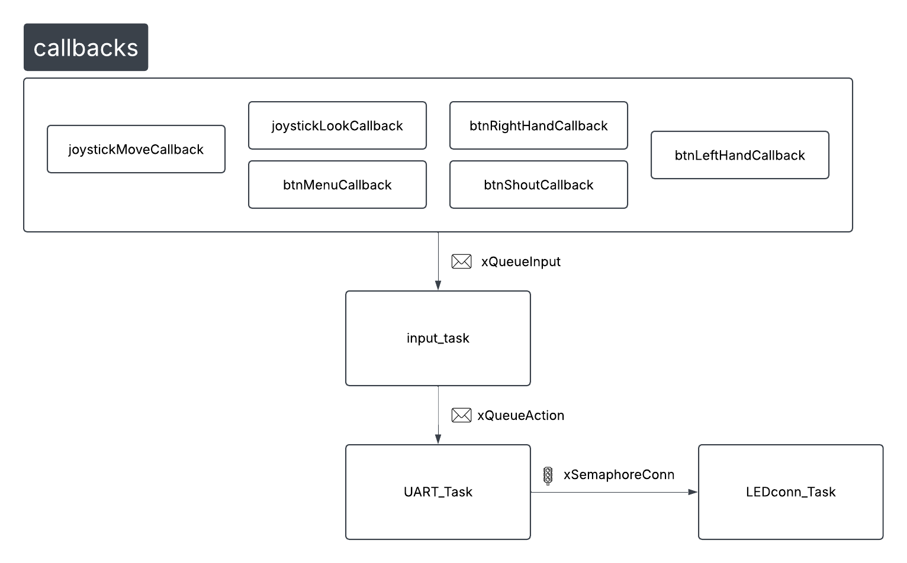
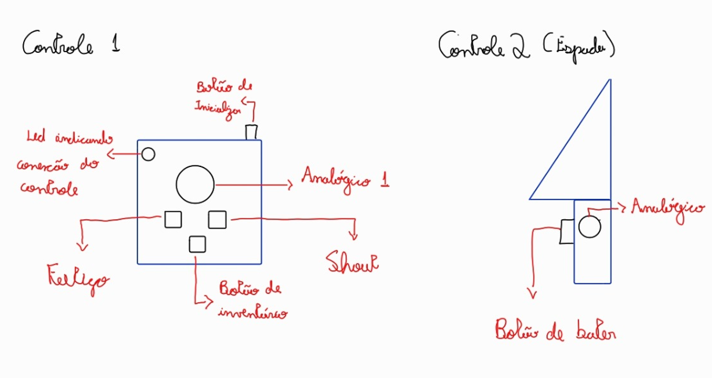

Controle Imersivo para TES V - Skyrim

Nesse projeto, um controle para o RPG famoso Skyrim sera feito, contando com 4 botoes e 2 analogicos.

Cada botao tera uma funcionalidade diferente, sendo essas:
* Usar item da mao direita
* Usar item da mao esquerda
* Usar um poder do personagem
* Abrir o menu do jogo

E os joysticks servirao para o movimento da camera e do personagem.

Segue abaixo o diagrama do codigo e uma representacao do controle:

